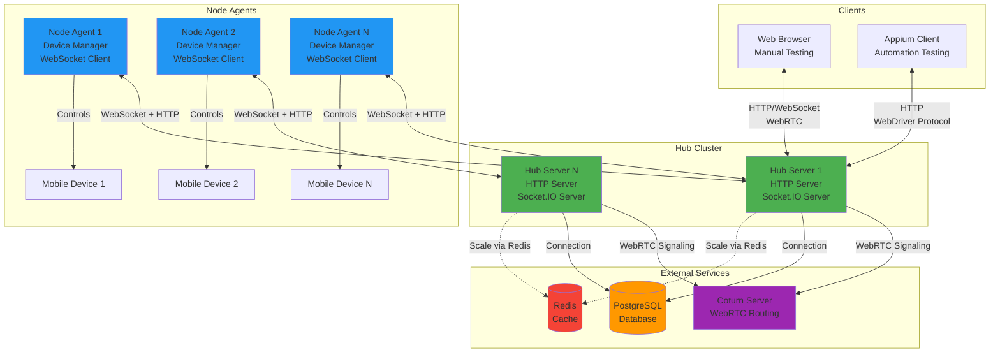
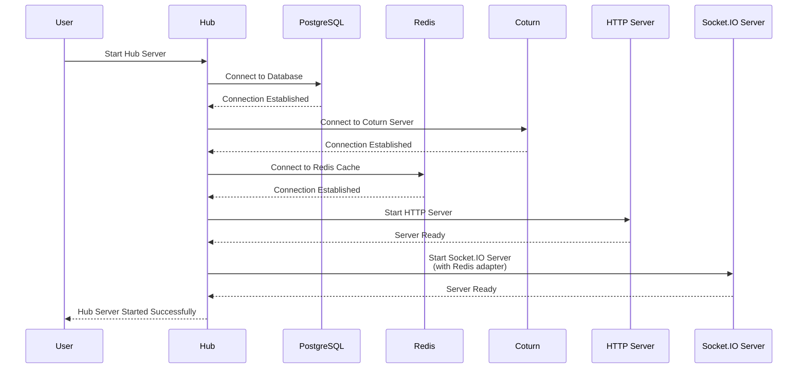
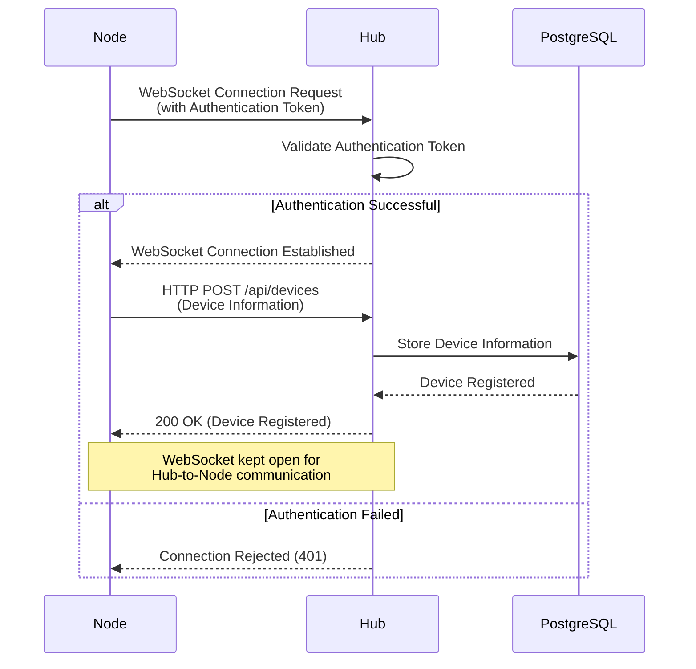
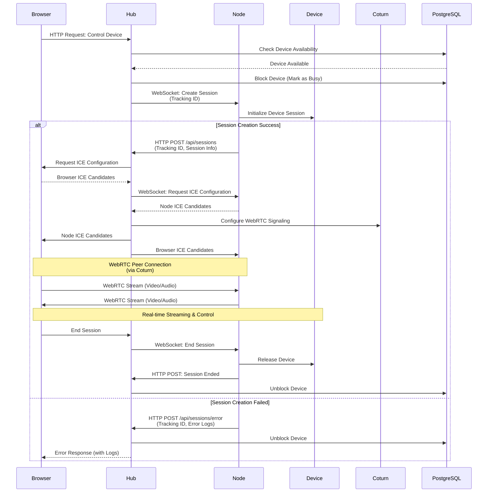
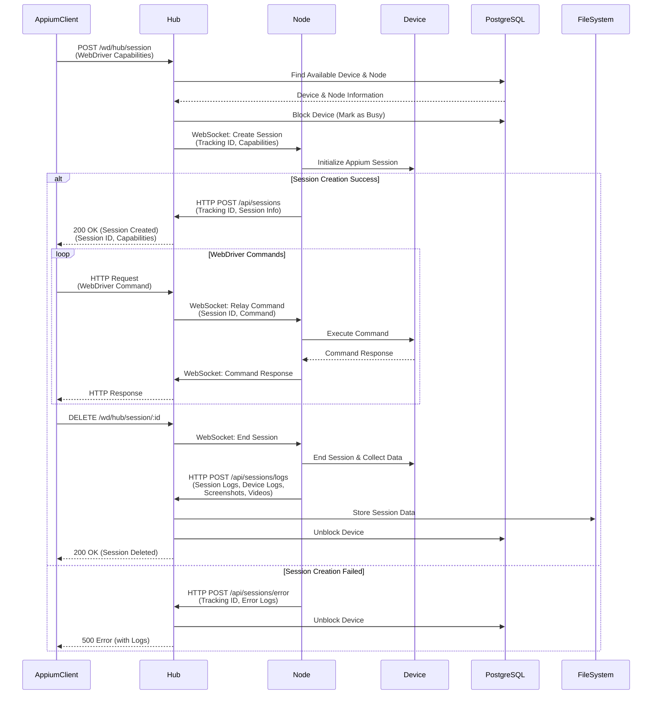
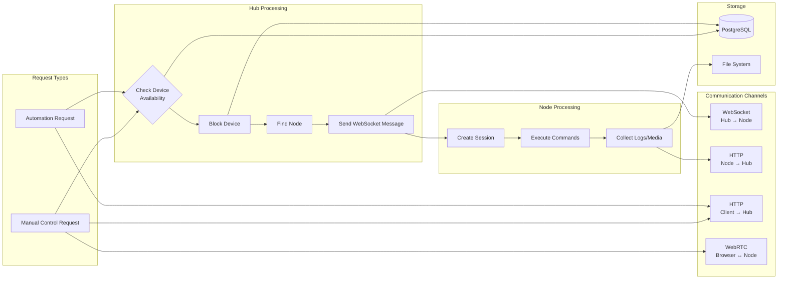

# Device Lab System - Architecture Diagram

## System Overview

This document describes the architecture of an advanced device lab system that enables remote access and automation testing of mobile devices from anywhere in the world.

## Component Diagram

## Hub Startup Sequence

## Node Registration Flow

## Manual Device Control Flow

## Automation Testing Flow

## Data Flow Diagram

## Key Architectural Decisions

### 1. Communication Patterns

- **Hub → Node**: WebSocket (for real-time commands and session management)
- **Node → Hub**: HTTP REST API (for device registration, session updates, logs)
- **Client → Hub**: HTTP REST API (for WebDriver protocol and device management)
- **Browser ↔ Node**: WebRTC (for real-time streaming via Coturn server)

### 2. Scalability

- Hub can be scaled horizontally using Redis adapter for Socket.IO
- Multiple Hub instances share session state via Redis
- PostgreSQL provides persistent storage for devices and sessions
- Each Node can manage multiple devices

### 3. Session Management

- Hub maintains device state (available/busy)
- Tracking IDs used to correlate WebSocket messages with HTTP responses
- Node is responsible for actual device interaction and session lifecycle
- Session data (logs, videos, screenshots) uploaded to Hub after session completion

### 4. Error Handling

- Failed session creation sends error logs back to client
- Device automatically unblocked on session failure
- All errors logged and tracked via Hub database

## Technology Stack

- **Hub**: Node.js/TypeScript with Express and Socket.IO
- **Node**: Node.js/TypeScript with WebSocket client
- **Database**: PostgreSQL (via Prisma ORM)
- **Cache**: Redis (Socket.IO adapter)
- **WebRTC**: Coturn server for STUN/TURN
- **Automation**: Appium/WebDriver protocol support
- **Real-time Streaming**: WebRTC for manual device control
