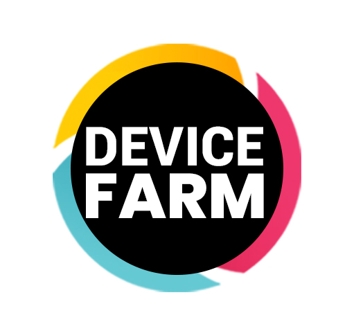
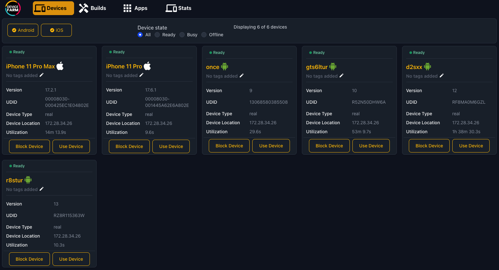
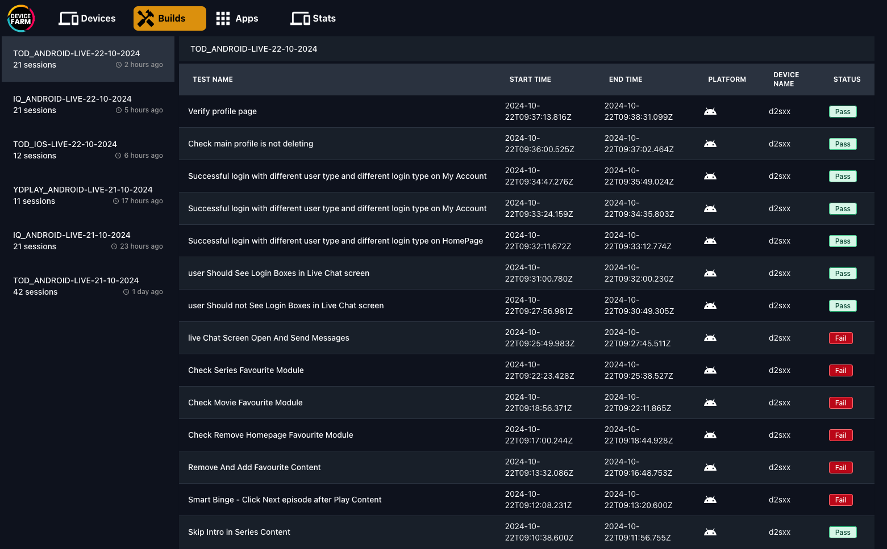
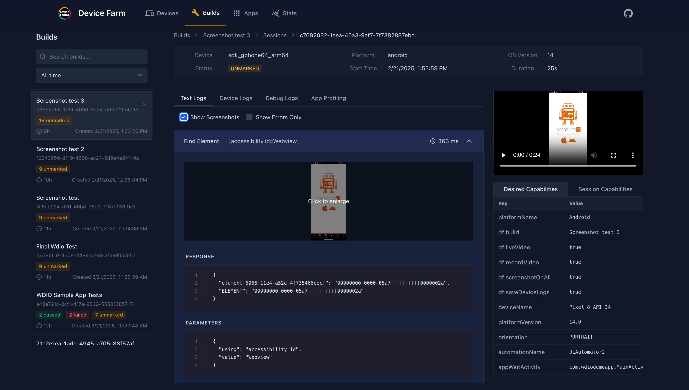
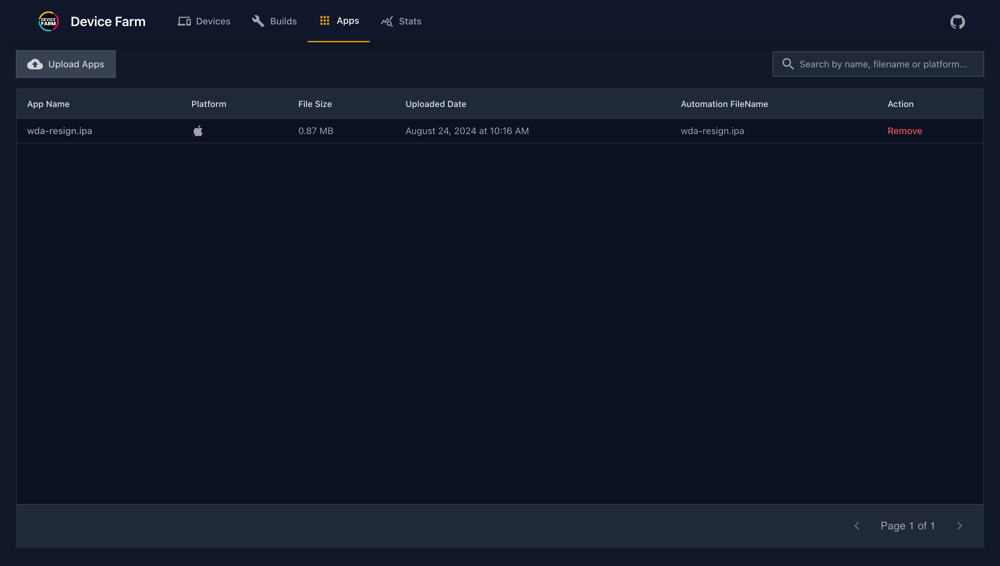
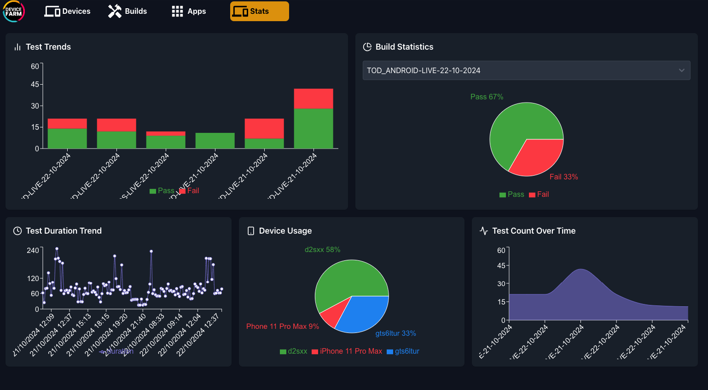

# appium-device-farm

<h1 align="center">
	<br>
	
	<br>
	<br>
	<br>
</h1>

[](https://dev.azure.com/saikrishna321/ATD/_build/latest?definitionId=11&branchName=main) [](https://badge.fury.io/js/appium-device-farm)

Appium Device-farm is a powerful plugin designed specifically to manage and streamline the creation of driver sessions for connected devices, including Android, iOS, and tvOS real devices, emulators, and simulators. This plugin extends the capabilities of Appium, making it easier for developers and testers to automate testing processes across a wide range of device types, ensuring that applications function smoothly in diverse environments.

With Appium Device-farm, teams can:

1. Remotely manage sessions for physical Android, iOS, and tvOS devices, emulators, and simulators, allowing for extensive cross-platform testing without the need for manual device handling.
2. Automate test execution across multiple devices simultaneously, reducing the time and effort required to perform comprehensive application testing.
3. Scale testing efforts to cover a broad array of device and OS combinations, ensuring that apps perform consistently across different hardware and software configurations.
4. Integrate seamlessly with CI/CD pipelines to automate testing as part of continuous integration workflows, catching bugs and issues early in the development cycle.
5. Monitor and manage test sessions through a user-friendly dashboard, providing real-time visibility into ongoing tests and detailed logs for easy debugging and troubleshooting.
6. Record and replay test runs, enabling teams to review test executions, reproduce issues, and ensure thorough testing coverage.

> [!IMPORTANT]
> ## 🚨 Breaking Changes - Version 10.0.0 and Above
> 
> Starting from version 10.0.0, we have introduced several breaking changes:
> - Added authentication module with user and team management
> - Enhanced automation runs with access key authentication
> - Improved device and server management capabilities
> - Database schema changes that may result in loss of existing data

# 🎯 Testimonials

## 🏢 Enterprise Team Experience

<details>
<summary><b>🚀 Revolutionary Change to Testing Processes</b></summary>

One of the biggest challenges we faced in our software development projects was testing the consistency of our applications across different devices and operating systems. Accessing physical devices with various hardware and software combinations was always difficult and costly. However, Appium Device-farm completely solved this issue by making our testing processes both faster and more comprehensive. This has allowed us to effortlessly scale our testing efforts as project demands grow, while still delivering high-quality releases.
</details>

<details>
<summary><b>🌐 Remote Testing on Real Devices</b></summary>

One of its greatest benefits is the ability to remotely test on real devices. Without the need to own physical devices, we can test our applications on devices around the world. This has been especially advantageous for our teams developing cross-platform applications (iOS, Android). Thanks to the wide variety of devices available, we can ensure that our software runs smoothly on every device in the market. Additionally, this feature has drastically reduced the time we spend setting up and maintaining test environments, freeing up resources to focus more on development and innovation.
</details>

<details>
<summary><b>⚡ Accelerating Processes with Automated Test Integrations</b></summary>

Automated test integrations have significantly sped up our processes as well. With Appium Device-farm's automated testing support, we can easily integrate tests into our continuous integration (CI) pipelines. This allows us to run automated tests across a broad range of devices immediately after code changes, reducing the manual testing load and identifying potential issues much earlier. Its seamless integration with our CI/CD workflows has improved our development cycle efficiency, ensuring faster release cycles without compromising quality.
</details>

<details>
<summary><b>📊 Monitoring and Recording Test Runs via the Dashboard</b></summary>

Thanks to Appium Device-farm's dashboard, we were able to monitor our automation test runs in real-time and even record them for later review. The detailed logs provided in the dashboard allowed us to resolve code errors quickly and with minimal effort. These monitoring and debugging capabilities have enabled our team to tackle issues more efficiently and provide rapid solutions.
</details>

<details>
<summary><b>🏠 Perfect Adaptation to Remote Work</b></summary>

Appium Device-farm has seamlessly adapted to our team's remote working setup. Developers and test engineers located in different cities and countries can perform their tests without being limited by device availability. This has not only sped up our workflow but also strengthened collaboration within the team. The ability to share test results and logs in real time has improved communication across the team, allowing for quicker troubleshooting and more efficient collaboration between developers and testers.
</details>

<details>
<summary><b>📈 Comprehensive Test Reporting and Insights</b></summary>

Another key feature that has been invaluable to our team is the detailed reporting and insights provided by Appium Device-farm. We can easily track the performance of our tests, identify potential bottlenecks, and analyze failures with clear, actionable data. This has allowed us to make informed decisions about where to focus our debugging efforts and has greatly improved visibility into the overall health of our applications.
</details>

<details>
<summary><b>✅ More Reliable and Comprehensive Testing Processes</b></summary>

Appium Device-farm has not only optimized our testing processes but also significantly improved the quality of our software. It has enabled our team to perform more reliable, comprehensive, and faster tests, ensuring that our applications are robust against all scenarios before reaching the end-users. With its extensive device coverage, automation capabilities, and user-friendly interface, Appium Device-farm has become an indispensable part of our development and testing workflow.
</details>

<details>
<summary><b>🚀 Simple Set-Up Process and Very Scalable</b></summary>
	
Appium Device Farm was instrumental in our transition from a third-party device farm service to a fully in-house setup. What we initially thought would be a lengthy, challenging process turned out to be remarkably smooth and efficient, taking less than two weeks instead of the expected month.

The setup is surprisingly straightforward — so much so that it almost feels too good to be true. The built-in dashboard provides an excellent interface for tracking and debugging sessions, and the hub/node topology enables easy scalability across multiple PCs, making it perfect for our growing needs.

I highly recommend Appium Device Farm to anyone looking to establish their own automated device farm. It’s a fantastic plugin that truly delivers!

</details>

## 👨‍💻 Developer Perspective (Veera)

<details>
<summary><b>🛠️ Streamlined Testing Experience</b></summary>

- ✨ Appium device farms makes both developer and testers life easy with the capability and features available.

- 🔄 Due to pandemic situations we are unable to test different applications on different devices but with the remote control feature we are able to test everything by keeping all devices connected in one place.

- 🔍 With the help of appium dashboard feature it makes life easy to identify, debug and fix the issues without keeping more effort.
</details>

<details>
<summary><b>⚙️ Improved Configuration and Compatibility Testing</b></summary>

- ⚡ Previously we are using appium start the server and stop the server for each test and it needs to build the configuration files runtime by checking ports available and all… but with the help of device farm able to configure the grid within minutes without facing any issues which reduces the more manual and monitoring effort.

- 🔄 With the help of apps feature we are able perform backward compatibility testing without doing any manual intervention just by passing automation name in the capacity with the help of appium device farm.
</details>

<details>
<summary><b>🤝 Outstanding Support and Future Outlook</b></summary>

The support and resources provided by the Appium device farm team were invaluable in getting things running smoothly. We're incredibly grateful for the dedication and hard work of the Appium device farm team, and we look forward to seeing the platform continue to evolve.
</details>

---
*💫 Join the developers and testers who have transformed their testing processes with Appium Device-farm!*

## Documentation

The [Documentation](https://devicefarm.org/) is hosted separately at
[Device Farm](https://devicefarm.org/)

## 🍎 tvOS Support

Appium Device-farm now supports Apple TV (tvOS) devices for comprehensive testing across Apple's ecosystem. To set up tvOS testing:

### Prerequisites for tvOS Testing

1. **Apple TV Device**: A physical Apple TV device with developer mode enabled
2. **Mac with Xcode**: Required for signing the WebDriverAgent
3. **Apple Developer Account**: For creating provisioning profiles
4. **iOS Resigner App**: Download from [iOS Resigner GitHub](https://github.com/DanTheMan827/ios-app-signer/releases)

### Setting up tvOS WebDriverAgent

1. **Download WDA**: Get the WDA.ipa file from the [Appium Device Farm repository](https://github.com/AppiumTestDistribution/appium-device-farm/raw/main/WDA.ipa)

2. **Create Provisioning Profile**: 
   - Open Xcode and create a new project
   - Ensure tvOS is selected as a supported platform
   - Generate a provisioning profile that includes tvOS support

3. **Resign WDA for tvOS**:
   - Use the iOS Resigner app to resign the WDA.ipa
   - **Important**: Save the output file as `wda-resign_tvos.ipa`
   - Upload the resigned file to the device farm dashboard

4. **Automatic Detection**: The device farm automatically detects and uses the appropriate WDA file:
   - iOS devices (iPhone, iPad) → `wda-resign.ipa`
   - tvOS devices (Apple TV) → `wda-resign_tvos.ipa`

For detailed step-by-step instructions, see the [iOS Signing Documentation](https://devicefarm.org/ios-signing/).

### tvOS Capabilities

When creating sessions for tvOS devices, use the following capability:

```json
{
  "appium:platformName": "tvOS",
  "appium:platformVersion": "16.1.1"
}
```

The device farm will automatically allocate tvOS devices and use the appropriate WebDriverAgent based on the platform specification.

## Contributing & Development

Clone this project from GitHub and run:

```bash
npm install
```

Build the project:

```bash
npm run build
```

To run unit/functional tests:

```bash
npm test # unit
npm run integration-android # Android integration tests
npm run integration-ios # iOS integration tests
```

To build docs locally:

```bash
npm install
npm run build
npm run install-docs-deps
npm run build:docs
```

Navigate to site directory and open index.html to view the site locally.

## License

This project is fully open source and licensed under the [Apache License 2.0](LICENSE).

Contributions are welcome! Please see the [LICENSE](LICENSE) file for details.

### Devices Page



### Builds Page



### Session Info Page



### Apps Page



### Stats Page



## Thanks to contributors 💙

<a href="https://github.com/AppiumTestDistribution/appium-device-farm/graphs/contributors">
  
</a>
