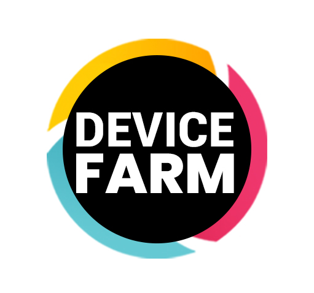
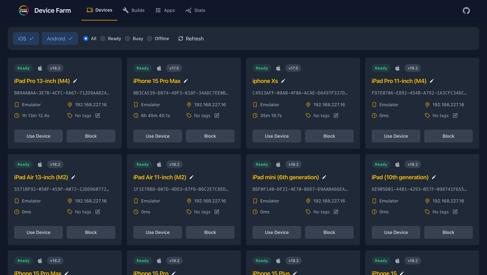
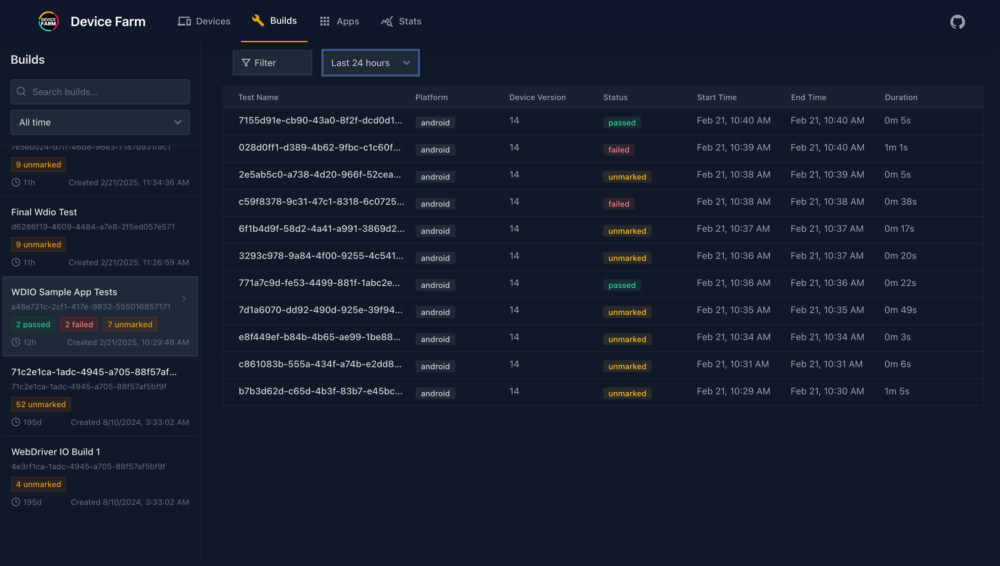

# appium-device-farm

<h1 align="center">
	<br>
	
	<br>
	<br>
	<br>
</h1>

[](https://dev.azure.com/saikrishna321/ATD/_build/latest?definitionId=11&branchName=main) [](https://badge.fury.io/js/appium-device-farm)

Appium Device-farm is a powerful plugin designed specifically to manage and streamline the creation of driver sessions for connected devices, including Android, iOS, and tvOS real devices, emulators, and simulators. This plugin extends the capabilities of Appium, making it easier for developers and testers to automate testing processes across a wide range of device types, ensuring that applications function smoothly in diverse environments.

> [!IMPORTANT]
> ## 🚀 Appium 3.x Compatibility
> 
> **Great news!** Appium Device-farm now supports both Appium 2.x and 3.x versions! 
> 
> - ✅ **Appium 2.11.3+** - Full compatibility
> - ✅ **Appium 3.0.0+** - Full compatibility
> 
> You can now install the plugin with either version:
> ```bash
> appium plugin install --source=npm appium-device-farm
> ```

## ✨ Key Features

### 🔄 Multi-Platform Support
- **Android**: Real devices, emulators, and cloud devices
- **iOS**: Real devices, simulators, and cloud devices  
- **tvOS**: Apple TV devices with WebDriverAgent support
- **Cross-platform**: Test on multiple platforms simultaneously

### 🚀 Advanced Device Management
- **Remote Device Control**: Access devices from anywhere
- **Automatic Device Allocation**: Smart device selection based on capabilities
- **Device Pool Management**: Organize and manage device collections
- **Real-time Device Monitoring**: Live status updates and health checks

### 📊 Comprehensive Dashboard
- **Real-time Monitoring**: Live test execution tracking
- **Session Management**: View and manage active test sessions
- **Device Analytics**: Performance metrics and utilization reports
- **Log Management**: Centralized logging and debugging tools

### 🔧 CI/CD Integration
- **Pipeline Integration**: Seamless CI/CD workflow integration
- **Parallel Testing**: Run tests across multiple devices simultaneously
- **Automated Reporting**: Generate test reports and analytics
- **Cloud Integration**: Support for cloud device providers

### 🛡️ Enterprise Features
- **Authentication**: User and team management with access control
- **API Access**: RESTful API for programmatic control
- **Scalability**: Hub-node architecture for distributed testing
- **Security**: Secure device access and session management

### 📱 App Management
- **App Upload**: Easy app deployment to devices
- **Version Control**: Manage multiple app versions
- **Compatibility Testing**: Test apps across different device configurations
- **Performance Monitoring**: Track app performance metrics

With Appium Device-farm, teams can:

1. **Remotely manage sessions** for physical Android, iOS, and tvOS devices, emulators, and simulators, allowing for extensive cross-platform testing without the need for manual device handling.
2. **Automate test execution** across multiple devices simultaneously, reducing the time and effort required to perform comprehensive application testing.
3. **Scale testing efforts** to cover a broad array of device and OS combinations, ensuring that apps perform consistently across different hardware and software configurations.
4. **Integrate seamlessly** with CI/CD pipelines to automate testing as part of continuous integration workflows, catching bugs and issues early in the development cycle.
5. **Monitor and manage** test sessions through a user-friendly dashboard, providing real-time visibility into ongoing tests and detailed logs for easy debugging and troubleshooting.
6. **Record and replay** test runs, enabling teams to review test executions, reproduce issues, and ensure thorough testing coverage.

> [!IMPORTANT]
> ## 🚨 Breaking Changes - Version 10.0.0 and Above
> 
> Starting from version 10.0.0, we have introduced several breaking changes:
> - Added authentication module with user and team management
> - Enhanced automation runs with access key authentication
> - Improved device and server management capabilities
> - Database schema changes that may result in loss of existing data

# 🎯 Testimonials

## 🏢 Enterprise Team Experience

<details>
<summary><b>🚀 Revolutionary Change to Testing Processes</b></summary>

One of the biggest challenges we faced in our software development projects was testing the consistency of our applications across different devices and operating systems. Accessing physical devices with various hardware and software combinations was always difficult and costly. However, Appium Device-farm completely solved this issue by making our testing processes both faster and more comprehensive. This has allowed us to effortlessly scale our testing efforts as project demands grow, while still delivering high-quality releases.
</details>

<details>
<summary><b>🌐 Remote Testing on Real Devices</b></summary>

One of its greatest benefits is the ability to remotely test on real devices. Without the need to own physical devices, we can test our applications on devices around the world. This has been especially advantageous for our teams developing cross-platform applications (iOS, Android). Thanks to the wide variety of devices available, we can ensure that our software runs smoothly on every device in the market. Additionally, this feature has drastically reduced the time we spend setting up and maintaining test environments, freeing up resources to focus more on development and innovation.
</details>

<details>
<summary><b>⚡ Accelerating Processes with Automated Test Integrations</b></summary>

Automated test integrations have significantly sped up our processes as well. With Appium Device-farm's automated testing support, we can easily integrate tests into our continuous integration (CI) pipelines. This allows us to run automated tests across a broad range of devices immediately after code changes, reducing the manual testing load and identifying potential issues much earlier. Its seamless integration with our CI/CD workflows has improved our development cycle efficiency, ensuring faster release cycles without compromising quality.
</details>

<details>
<summary><b>📊 Monitoring and Recording Test Runs via the Dashboard</b></summary>

Thanks to Appium Device-farm's dashboard, we were able to monitor our automation test runs in real-time and even record them for later review. The detailed logs provided in the dashboard allowed us to resolve code errors quickly and with minimal effort. These monitoring and debugging capabilities have enabled our team to tackle issues more efficiently and provide rapid solutions.
</details>

<details>
<summary><b>🏠 Perfect Adaptation to Remote Work</b></summary>

Appium Device-farm has seamlessly adapted to our team's remote working setup. Developers and test engineers located in different cities and countries can perform their tests without being limited by device availability. This has not only sped up our workflow but also strengthened collaboration within the team. The ability to share test results and logs in real time has improved communication across the team, allowing for quicker troubleshooting and more efficient collaboration between developers and testers.
</details>

<details>
<summary><b>📈 Comprehensive Test Reporting and Insights</b></summary>

Another key feature that has been invaluable to our team is the detailed reporting and insights provided by Appium Device-farm. We can easily track the performance of our tests, identify potential bottlenecks, and analyze failures with clear, actionable data. This has allowed us to make informed decisions about where to focus our debugging efforts and has greatly improved visibility into the overall health of our applications.
</details>

<details>
<summary><b>✅ More Reliable and Comprehensive Testing Processes</b></summary>

Appium Device-farm has not only optimized our testing processes but also significantly improved the quality of our software. It has enabled our team to perform more reliable, comprehensive, and faster tests, ensuring that our applications are robust against all scenarios before reaching the end-users. With its extensive device coverage, automation capabilities, and user-friendly interface, Appium Device-farm has become an indispensable part of our development and testing workflow.
</details>

<details>
<summary><b>🚀 Simple Set-Up Process and Very Scalable</b></summary>
	
Appium Device Farm was instrumental in our transition from a third-party device farm service to a fully in-house setup. What we initially thought would be a lengthy, challenging process turned out to be remarkably smooth and efficient, taking less than two weeks instead of the expected month.

The setup is surprisingly straightforward — so much so that it almost feels too good to be true. The built-in dashboard provides an excellent interface for tracking and debugging sessions, and the hub/node topology enables easy scalability across multiple PCs, making it perfect for our growing needs.

I highly recommend Appium Device Farm to anyone looking to establish their own automated device farm. It’s a fantastic plugin that truly delivers!

</details>

## 👨‍💻 Developer Perspective (Veera)

<details>
<summary><b>🛠️ Streamlined Testing Experience</b></summary>

- ✨ Appium device farms makes both developer and testers life easy with the capability and features available.

- 🔄 Due to pandemic situations we are unable to test different applications on different devices but with the remote control feature we are able to test everything by keeping all devices connected in one place.

- 🔍 With the help of appium dashboard feature it makes life easy to identify, debug and fix the issues without keeping more effort.
</details>

<details>
<summary><b>⚙️ Improved Configuration and Compatibility Testing</b></summary>

- ⚡ Previously we are using appium start the server and stop the server for each test and it needs to build the configuration files runtime by checking ports available and all… but with the help of device farm able to configure the grid within minutes without facing any issues which reduces the more manual and monitoring effort.

- 🔄 With the help of apps feature we are able perform backward compatibility testing without doing any manual intervention just by passing automation name in the capacity with the help of appium device farm.
</details>

<details>
<summary><b>🤝 Outstanding Support and Future Outlook</b></summary>

The support and resources provided by the Appium device farm team were invaluable in getting things running smoothly. We're incredibly grateful for the dedication and hard work of the Appium device farm team, and we look forward to seeing the platform continue to evolve.
</details>

---
*💫 Join the developers and testers who have transformed their testing processes with Appium Device-farm!*

## 📦 Installation

### Prerequisites

- **Appium 2.11.3+** or **Appium 3.0.0+**
- Node.js 14.17.0+ or 16.13.0+ or 18.0.0+
- npm 8+

### Install the Plugin

```bash
# Install Appium (if not already installed)
npm install -g appium

# Install the device-farm plugin
appium plugin install --source=npm appium-device-farm
```

### Verify Installation

```bash
# Check if the plugin is installed
appium plugin list

# You should see 'device-farm' in the list
```

### Quick Start

1. **Start Appium with the plugin**:
   ```bash
   appium server --use-plugins=device-farm
   ```

2. **Access the dashboard**:
   - Open your browser and go to `http://localhost:4723/device-farm/`
   - The dashboard will show all connected devices

3. **Configure your test**:
   ```javascript
   const capabilities = {
     'appium:platformName': 'Android',
     'appium:deviceName': 'Any', // Device-farm will allocate available device
     'appium:app': '/path/to/your/app.apk'
   };
   ```

For detailed configuration options, see the [Configuration Guide](https://devicefarm.org/setup/).

## 🔄 Changelog

### Latest Updates

#### ✅ Appium 3.x Compatibility (Latest)
- **Added support for Appium 3.0.0+** alongside existing Appium 2.x support
- Updated peer dependencies to support both Appium 2.11.3+ and 3.0.0+
- Enhanced @appium/base-plugin compatibility (2.3.5+ || 3.0.0+)
- Updated @appium/types compatibility (0.x || 1.0.0+)
- **Express v5 compatibility** - Updated middleware and routes for Express v5
- **No breaking changes** - existing configurations continue to work

#### 🔧 Previous Updates
- Enhanced authentication module with user and team management
- Improved device and server management capabilities
- Added comprehensive tvOS support
- Enhanced dashboard with real-time monitoring
- Improved CI/CD integration capabilities

For the complete changelog, see [CHANGELOG.md](CHANGELOG.md).

## 🛠️ Troubleshooting

### Common Issues

#### Plugin Installation Issues

**Problem**: `'appium-device-farm' cannot be installed because the server version it requires (^2.11.3) does not meet the currently installed one (3.0.2)`

**Solution**: This issue has been resolved! The plugin now supports both Appium 2.x and 3.x. Make sure you're using the latest version:

```bash
# Update to the latest version
npm update -g appium-device-farm

# Or reinstall
appium plugin uninstall device-farm
appium plugin install --source=npm appium-device-farm
```

#### Appium Version Compatibility

**Problem**: Plugin not working with Appium 3.x

**Solution**: Ensure you're using the latest version of the plugin that supports Appium 3.x:

```bash
# Check your Appium version
appium --version

# Check plugin version
appium plugin list

# Update if needed
appium plugin install --source=npm appium-device-farm@latest
```

#### Dashboard Not Loading

**Problem**: Dashboard not accessible at `http://localhost:4723/device-farm/`

**Solution**: 
1. Ensure Appium is running with the plugin: `appium server --use-plugins=device-farm`
2. Check if the port is correct (default: 4723)
3. Verify the plugin is loaded: `appium plugin list`

### Getting Help

- 📖 **Documentation**: [Device Farm Docs](https://devicefarm.org/)
- 🐛 **Issues**: [GitHub Issues](https://github.com/AppiumTestDistribution/appium-device-farm/issues)
- 💬 **Discussions**: [GitHub Discussions](https://github.com/AppiumTestDistribution/appium-device-farm/discussions)

## 📚 Documentation

The [Documentation](https://devicefarm.org/) is hosted separately at
[Device Farm](https://devicefarm.org/)

## 🍎 tvOS Support

Appium Device-farm now supports Apple TV (tvOS) devices for comprehensive testing across Apple's ecosystem. To set up tvOS testing:

### Prerequisites for tvOS Testing

1. **Apple TV Device**: A physical Apple TV device with developer mode enabled
2. **Mac with Xcode**: Required for signing the WebDriverAgent
3. **Apple Developer Account**: For creating provisioning profiles
4. **iOS Resigner App**: Download from [iOS Resigner GitHub](https://github.com/DanTheMan827/ios-app-signer/releases)

### Setting up tvOS WebDriverAgent

1. **Download WDA**: Get the WDA.ipa file from the [Appium Device Farm repository](https://github.com/AppiumTestDistribution/appium-device-farm/raw/main/WDA.ipa)

2. **Create Provisioning Profile**: 
   - Open Xcode and create a new project
   - Ensure tvOS is selected as a supported platform
   - Generate a provisioning profile that includes tvOS support

3. **Resign WDA for tvOS**:
   - Use the iOS Resigner app to resign the WDA.ipa
   - **Important**: Save the output file as `wda-resign_tvos.ipa`
   - Upload the resigned file to the device farm dashboard

4. **Automatic Detection**: The device farm automatically detects and uses the appropriate WDA file:
   - iOS devices (iPhone, iPad) → `wda-resign.ipa`
   - tvOS devices (Apple TV) → `wda-resign_tvos.ipa`

For detailed step-by-step instructions, see the [iOS Signing Documentation](https://devicefarm.org/ios-signing/).

### tvOS Capabilities

When creating sessions for tvOS devices, use the following capability:

```json
{
  "appium:platformName": "tvOS",
  "appium:platformVersion": "16.1.1"
}
```

The device farm will automatically allocate tvOS devices and use the appropriate WebDriverAgent based on the platform specification.

## Contributing & Development

Clone this project from GitHub and run:

```bash
npm install
```

Build the project:

```bash
npm run build
```

To run unit/functional tests:

```bash
npm test # unit
npm run integration-android # Android integration tests
npm run integration-ios # iOS integration tests
```

To build docs locally:

```bash
npm install
npm run build
npm run install-docs-deps
npm run build:docs
```

Navigate to site directory and open index.html to view the site locally.

## Licensing

The Appium Device Farm Plugin uses a hybrid licensing model to balance open-source principles with the protection of certain proprietary components:

1. **Open Source Components**:
   The majority of this project is open source and licensed under the MIT License. This includes all files and directories except those explicitly listed as proprietary.

2. **Proprietary Components**:
   The following components, while included in the distribution, are proprietary and provided in an obfuscated form:

   - src/modules/
   - dashboard-frontend

   These components are integral parts of the plugin but their source code is not open for modification or redistribution.

### Using the Appium Device Farm Plugin

The Appium Device Farm Plugin, including both open source and obfuscated proprietary components, is freely available for use under the terms specified in the LICENSE file. Users can utilize all functionalities provided by the plugin, including those powered by the proprietary components.

### Important Notes on Proprietary Components

- While the proprietary components are included in the distribution, their source code is not available for viewing, modification, or redistribution.
- These components are provided in an obfuscated form to protect our intellectual property.
- Users are granted the right to use these components as part of the Appium Device Farm Plugin, but not to decompile, reverse engineer, or attempt to extract the original source code.

### Contributions and Modifications

- Contributions and modifications to the open-source portions of the plugin are welcome.
- Please note that it is not possible to contribute to or modify the proprietary components due to their obfuscated nature.

For full license details, please see the [LICENSE](LICENSE) file in this repository. If you have any questions about the licensing or use of the Appium Device Farm Plugin, please open an issue in this repository.

### Devices Page



### Use Devices Page


### Builds Page



### Session Info Page


### Apps Page


### Stats Page


## Thanks to contributors 💙

<a href="https://github.com/AppiumTestDistribution/appium-device-farm/graphs/contributors">
  
</a>
