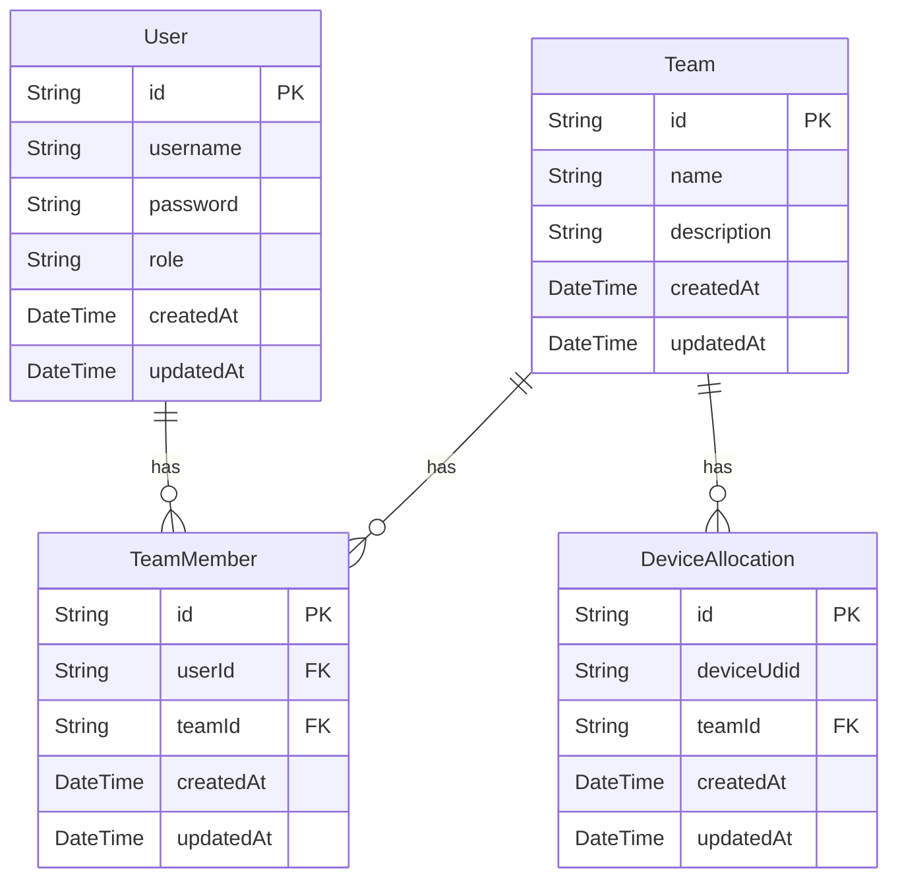
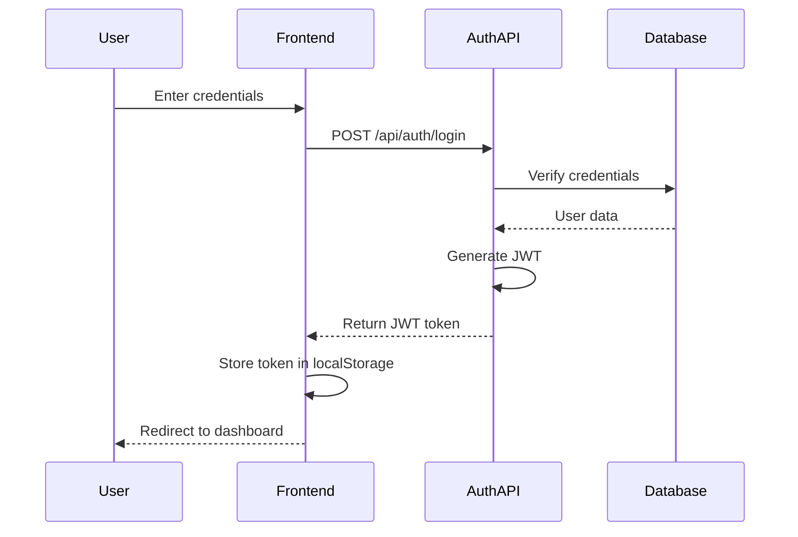
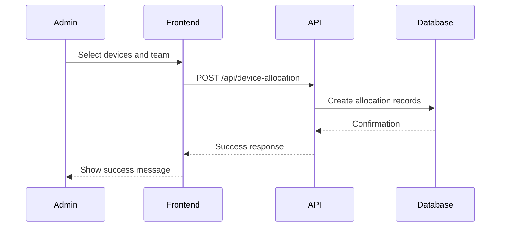
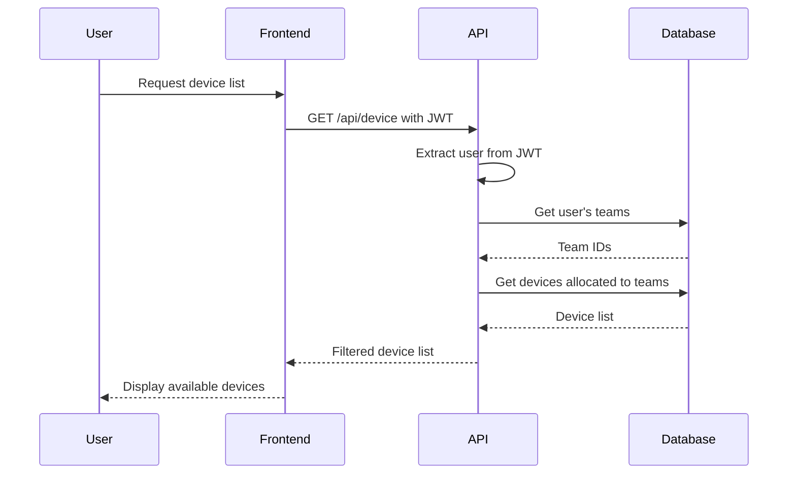

# Admin Portal for Device Allocation - Implementation Plan

## Current System Analysis

The Appium Device Farm currently:
- Manages devices for testing through a hub-node architecture
- Has a React-based frontend dashboard
- Uses Prisma with SQLite for data storage
- Has APIs for device management (block/unblock, status checking)
- Has no user authentication or team management system

## Requirements

1. Admin portal for device allocation
2. Team-based access control for devices
3. Admin users can allocate/deallocate devices to teams
4. Team members can only access devices allocated to their team
5. Simple authentication (no OAuth)
6. Admin user management (universal admin with password change capability)
7. Local database storage for user credentials

## Implementation Plan

### 1. Database Schema Updates

We need to add new tables to the Prisma schema:

### 2. Authentication System

1. Create authentication middleware
2. Implement login/logout functionality
3. Add password hashing for security
4. Create session management (JWT-based)
5. Add role-based access control (admin vs. team member)

### 3. Backend API Endpoints

Create new API endpoints for:

1. **User Management**
   - Create/update/delete users
   - Change password
   - List users

2. **Team Management**
   - Create/update/delete teams
   - Add/remove users from teams
   - List teams and their members

3. **Device Allocation**
   - Allocate devices to teams
   - Deallocate devices from teams
   - List device allocations

4. **Authentication**
   - Login
   - Logout
   - Get current user

### 4. Frontend Components

Add new pages and components to the dashboard:

1. **Login Page**
   - Username/password form
   - Error handling

2. **Admin Dashboard**
   - User management section
   - Team management section
   - Device allocation section

3. **Team Member Dashboard**
   - View allocated devices
   - Access device details

4. **Navigation Updates**
   - Add login/logout buttons
   - Show different navigation based on user role

### 5. Integration with Existing System

1. Modify device access control to check team allocations
2. Update device listing to filter based on team membership
3. Integrate authentication with existing API endpoints

### 6. Implementation Steps

#### Phase 1: Database and Authentication Setup

1. Update Prisma schema with new models
2. Create migration for the new tables
3. Implement basic authentication system
4. Create admin user management APIs

#### Phase 2: Team Management

1. Implement team CRUD operations
2. Create team membership management
3. Build team management UI

#### Phase 3: Device Allocation

1. Implement device allocation APIs
2. Update device access control
3. Create device allocation UI

#### Phase 4: Integration and Testing

1. Integrate authentication with existing endpoints
2. Update device listing to respect team allocations
3. Test all functionality
4. Fix any issues

## Technical Details

### Authentication Flow

### Device Allocation Flow

### Device Access Control Flow

## File Changes Required

1. **Prisma Schema Update**
   - Add User, Team, TeamMember, and DeviceAllocation models

2. **New Backend Files**
   - Authentication middleware
   - User controller
   - Team controller
   - Device allocation controller
   - Authentication controller

3. **New Frontend Files**
   - Login page
   - Admin dashboard components
   - Team management components
   - Device allocation components
   - Authentication service

4. **Existing File Modifications**
   - Update device service to check team allocations
   - Modify API routes to use authentication
   - Update frontend device listing to respect allocations

## Security Considerations

1. Password hashing using bcrypt
2. JWT with appropriate expiration
3. HTTPS for all communications
4. Input validation and sanitization
5. Protection against common attacks (CSRF, XSS)

## Conclusion

This implementation plan provides a comprehensive approach to adding an admin portal with team-based device allocation to the Appium Device Farm. The solution is designed to be simple yet secure, without requiring OAuth integration.