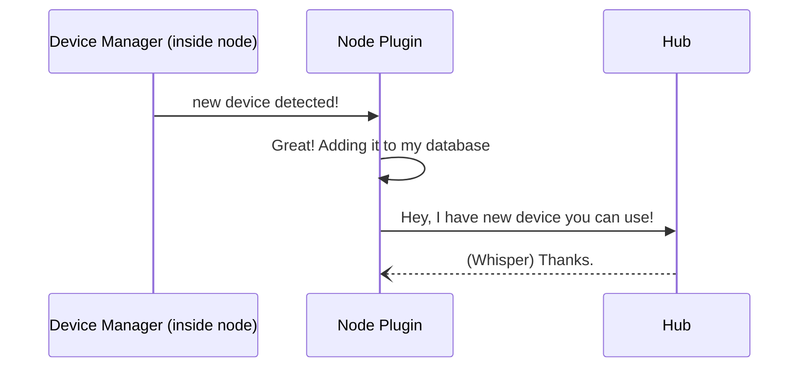
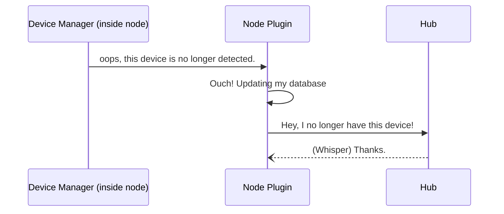
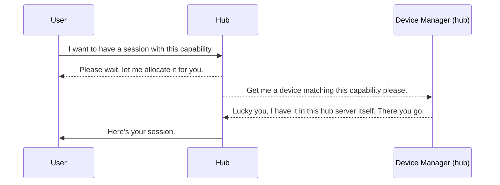
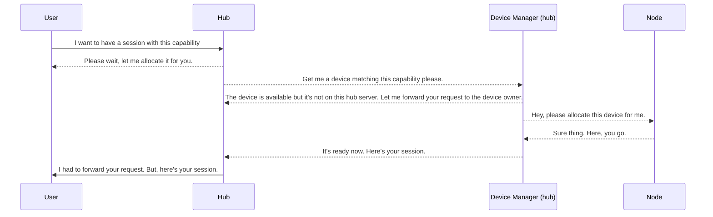
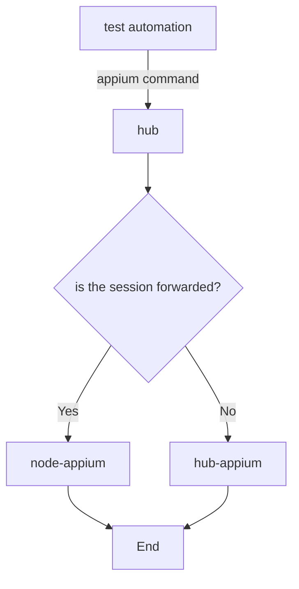

# Appium Device Farm Architecture
Here are some diagram to illustrate how the plugin works.

## Device Inventory
### Device Added
When the device trackers see new device.

### Device Removed
When the device trackers see missing device.

## Session Request
The following diagrams illustrate how session is created.
### Device is on the hub
When target device is hosted on the hub.

### Device is on the node
When target device is hosted on the node.

## Device Allocation
When a session is to be created, the plugin will block the device on the hub. This will prevent subsequent request from getting the same device. Once device is blocked, hub will create a session using aforementioned device. 

When the device is hosted on a node (not the hub), session request will be forwarded. The plugin in the node will receive the session request and apply the same logic as the above.

When a device is getting allocated for a session, the device will be blocked (marked as `busy`).

## Forwarded Session
When session is allocated in the node, the hub will act as a gateway. It's keeping the record of session id and which node is serving this particular session.

