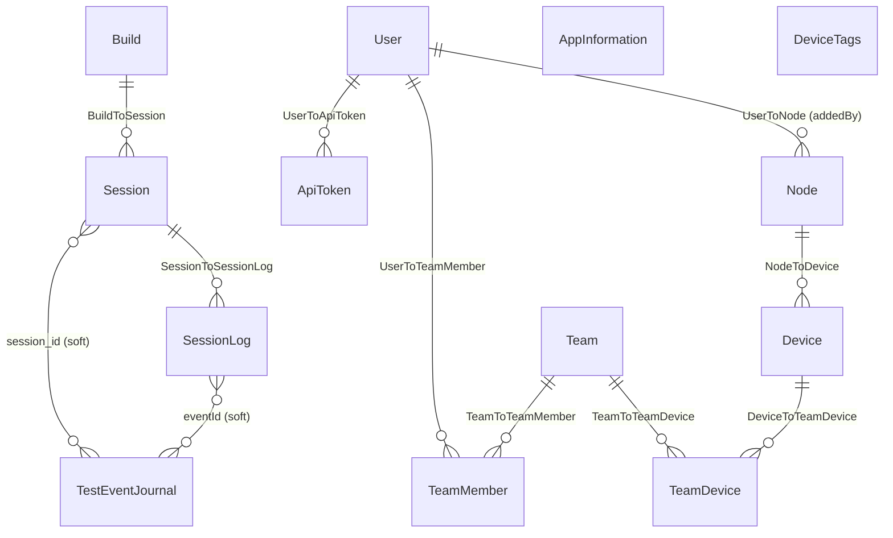

**Lens:** engineer

# 05 — Data Model

> Scope: Prisma schema, migration history, DB engine, and primary data-access patterns.
> Source of truth: [`prisma/schema.prisma`](../../prisma/schema.prisma).

---

## 1. Annotated Prisma Schema

### DB provider

[`prisma/schema.prisma:1-4`](../../prisma/schema.prisma#L1)

```prisma
datasource db {
  provider = "sqlite"
  url      = env("DATABASE_URL")
}
```

The declared provider is **SQLite**. At runtime `DATABASE_URL` is overridden in
[`src/prisma.ts:4-9`](../../src/prisma.ts#L4): the client is constructed with
`url: file:${config.databasePath}`, where `config.databasePath` resolves to
`~/.cache/appium-device-farm/device-farm-latest.db?connection_limit=1`
([`src/config.ts:45`](../../src/config.ts#L45)).

---

### Session cluster

#### `Build` ([schema:10-16](../../prisma/schema.prisma#L10))

Groups one or more test sessions into a named run. Optional name; auto-UUID id.

| Column | Type | Notes |
|--------|------|-------|
| `id` | TEXT PK | UUID default |
| `name` | TEXT? | Optional build label from capability |
| `createdAt` / `updatedAt` | DateTime | Standard timestamps |

Relationship: one `Build` → many `Session` (nullable FK `build_id`).

#### `Session` ([schema:18-41](../../prisma/schema.prisma#L18))

Core record for each Appium session. Written when a session is created; updated
on completion or failure.

| Column | Type | Notes |
|--------|------|-------|
| `id` | TEXT PK | Appium-generated session id (not UUID-default) |
| `buildId` | TEXT? FK | Nullable link to `Build` |
| `status` | TEXT | Default `"running"`; set to `"passed"` / `"failed"` on teardown |
| `desiredCapabilities` | TEXT | JSON blob of original caps |
| `sessionCapabilities` | TEXT | JSON blob of resolved caps returned by node |
| `nodeId` | TEXT | Which Appium node handled this session |
| `hasLiveVideo` | Boolean | Whether a live video stream was available |
| `videoRecording` | TEXT? | Path or URL to recording artifact |
| `deviceLogs` | TEXT? | Path or URL to device log artifact (added in migration `20240409`) |
| `appProfiling` | TEXT? | Path or URL to profiling artifact (added `20240410`) |
| `startTime` / `endTime` | DateTime | Wall-clock session window |
| `failureReason` | TEXT? | Error message on session failure |
| `deviceUdid` | TEXT | UDID of the device that ran the session |
| `devicePlatform` | TEXT | `ios` or `android` |
| `deviceVersion` | TEXT | OS version string |
| `deviceName` | TEXT? | Human-readable device name |

Relationships: belongs to `Build?`; has many `SessionLog`.

**Note:** `nodeId` is a plain string at the session level — it does NOT have a
foreign key constraint to the `Node` table. The two are not relationally linked.

#### `SessionLog` ([schema:43-59](../../prisma/schema.prisma#L43))

One row per Appium command executed within a session. High-volume write path.

| Column | Type | Notes |
|--------|------|-------|
| `id` | TEXT PK | UUID |
| `sessionId` | TEXT FK | → `Session.id` |
| `commandName` | TEXT? | Human label for the Appium command |
| `url` | TEXT | Appium endpoint URL |
| `method` | TEXT | HTTP method (GET/POST/DELETE) |
| `title` / `subtitle` | TEXT | Display label fields for the dashboard |
| `body` | TEXT? | Request body blob |
| `response` | TEXT | Response body blob |
| `screenshot` | TEXT? | Base64 or path to screenshot artifact |
| `isSuccess` | Boolean? | True if command returned without error |
| `eventId` | TEXT? | Link to `TestEventJournal.event_uuid` (soft reference, no FK) |

No DB index on `sessionId`; queries rely on the FK scan.

#### `TestEventJournal` ([schema:61-75](../../prisma/schema.prisma#L61))

Structured test-event log (suite/test start/finish events from the test runner,
e.g. via the `@wdio/reportportal-reporter` integration).

| Column | Type | Notes |
|--------|------|-------|
| `id` | TEXT PK | UUID |
| `session_id` | TEXT | Soft reference to `Session.id` (no FK) |
| `event_uuid` | TEXT UNIQUE | Unique per event; cross-referenced by `SessionLog.eventId` |
| `event_type` | TEXT | e.g. `SUITE`, `TEST` |
| `event_sub_type` | TEXT | e.g. `START`, `FINISH` |
| `name` | TEXT | Test/suite name |
| `scopes` | TEXT | JSON blob of scope context |
| `result` | TEXT? | `PASSED`, `FAILED`, etc. |
| `started_at` / `finished_at` | DateTime? | Event timestamps |
| `start_event_doc` / `finished_event_doc` | TEXT? | Raw JSON payloads |
| `file` | TEXT | Source file that emitted the event |

No FK to `Session`. `session_id` is a plain string.

---

### App-artifact cluster

#### `AppInformation` ([schema:77-86](../../prisma/schema.prisma#L77))

Metadata about uploaded `.apk` / `.ipa` files. No relation to other models.

| Column | Type | Notes |
|--------|------|-------|
| `id` | TEXT PK | UUID |
| `fileName` | TEXT | Original filename |
| `uploadedFileName` | TEXT | Name on disk after upload (may differ to avoid collisions) |
| `path` | TEXT | Filesystem path |
| `platform` | TEXT | `ios` or `android` |
| `fileSize` | TEXT | Stored as string, default `"0"` (added `20240503`) |
| `appBundleId` | TEXT | Bundle / package ID (added `20240509`, default `""`) |
| `createdAt` | DateTime | Upload timestamp |

**Unknown:** `updatedAt` is absent here but present on most other models. No
relational link to sessions or devices.

---

### Device-tags legacy model

#### `DeviceTags` ([schema:88-94](../../prisma/schema.prisma#L88))

Originally used to persist per-device tags before the `Device` model existed.
Composite unique index on `(host, udid)`.

| Column | Type | Notes |
|--------|------|-------|
| `host` | TEXT | Node hostname |
| `udid` | TEXT | Device UDID |
| `tags` | TEXT? | Comma-separated tag list |

**No PK column** — `(host, udid)` unique constraint acts as natural key.
There are only 2 `prisma.deviceTags.` call sites in the codebase; this model
appears superseded by `Device.tags`.

---

### Auth / RBAC cluster

All seven models below were created in a single migration (`20250509132713_authentication`).

#### `User` ([schema:96-110](../../prisma/schema.prisma#L96))

| Column | Type | Notes |
|--------|------|-------|
| `id` | TEXT PK | UUID |
| `username` | TEXT UNIQUE | Login name |
| `password` | TEXT | Hashed password (bcrypt assumed; **Unknown:** algorithm not confirmed in schema) |
| `role` | TEXT | `"admin"` or `"user"` (comment inline) |
| `isActive` | Boolean | Soft-delete / suspension flag |
| `accessKey` | TEXT UNIQUE | Short-lived or static API key for session auth |
| `firstname` / `lastname` | TEXT | Display name parts |

Relationships: has many `TeamMember`, `ApiToken`, `Node` (nodes added by this user).

#### `Team` ([schema:112-120](../../prisma/schema.prisma#L112))

Named group of users and devices.

| Column | Type | Notes |
|--------|------|-------|
| `id` | TEXT PK | UUID |
| `name` | TEXT UNIQUE | Team name |
| `description` | TEXT? | Optional |

Relationships: has many `TeamMember`, `TeamDevice`.

#### `TeamMember` ([schema:122-132](../../prisma/schema.prisma#L122))

Junction table: User ↔ Team. Cascade-deletes on both sides.
Unique constraint: `(userId, teamId)`.

#### `TeamDevice` ([schema:134-144](../../prisma/schema.prisma#L134))

Junction table: Device ↔ Team. Cascade-deletes on both sides.
Unique constraint: `(deviceId, teamId)`.

#### `Device` ([schema:146-165](../../prisma/schema.prisma#L146))

Persistent device registry. Written when a node reports devices; soft-deleted
(`isActive = false`) when a node goes offline.

| Column | Type | Notes |
|--------|------|-------|
| `id` | TEXT PK | Deterministic UUID via `uuid-by-string(udid)` for real/iOS, `uuid-by-string(nodeId-udid)` for emulators |
| `udid` | TEXT | Device UDID |
| `host` | TEXT | Reporting node's hostname |
| `nodeId` | TEXT FK | → `Node.id` (cascade delete) |
| `platform` | TEXT | `ios` or `android` |
| `version` | TEXT | OS version |
| `name` | TEXT | Device display name |
| `tags` | TEXT? | Comma-separated |
| `real` | Boolean | `true` = physical device |
| `isActive` | Boolean | `false` = node offline / device removed |
| `isFlagged` | Boolean | Maintenance/excluded flag |
| `flaggedReason` | TEXT? | Reason text |
| `usage` | BigInt | Cumulative session utilization in milliseconds |

Unique constraint: `(udid, host)`.

#### `ApiToken` ([schema:168-179](../../prisma/schema.prisma#L168))

Named bearer tokens scoped to a user. Optional expiry.

| Column | Type | Notes |
|--------|------|-------|
| `id` | TEXT PK | Manually assigned (no `@default`) |
| `name` | TEXT | Human label |
| `userId` | TEXT FK | → `User.id` (cascade delete) |
| `token` | TEXT | The raw token string |
| `expiresAt` | DateTime? | Null = non-expiring |

Unique constraint: `(userId, name)`.

#### `Node` ([schema:181-196](../../prisma/schema.prisma#L181))

Registry of hub and worker nodes.

| Column | Type | Notes |
|--------|------|-------|
| `id` | TEXT PK | Manually assigned (node UUID from metadata file) |
| `name` | TEXT | Hostname or user-supplied name |
| `host` | TEXT | Base URL of node |
| `os` | TEXT | `mac`, `linux`, `win32` |
| `jwtSecretToken` | TEXT | Per-node JWT signing secret |
| `isHub` | Boolean | True if this record is the hub itself |
| `isOnline` | Boolean | Set false when node heartbeat is lost |
| `addedBy` | TEXT? FK | → `User.id` (nullable; cascade delete) |
| `tags` | TEXT? | Comma-separated |

---

## 2. ERD



Dashed relations (`soft`) indicate `session_id` / `eventId` string columns with
no enforced FK constraint.

---

## 3. Migration History

All migrations live in [`prisma/migrations/`](../../prisma/migrations/).

| Directory | Date (inferred) | Summary |
|-----------|----------------|---------|
| [`20231011074725_initial_tables`](../../prisma/migrations/20231011074725_initial_tables/migration.sql) | 2023-10-11 | Creates `Build`, `Session`, `SessionLog` with camelCase columns. |
| [`20231226115334_update_session_log`](../../prisma/migrations/20231226115334_update_session_log/migration.sql) | 2023-12-26 | Adds nullable `isSuccess` boolean to `SessionLog`. |
| [`20240311161212_naming_convention`](../../prisma/migrations/20240311161212_naming_convention/migration.sql) | 2024-03-11 | Full column rename from camelCase to snake_case across `Build`, `Session`, `SessionLog`. Destructive SQLite redefine; existing data migrated with partial INSERT (some columns lost). |
| [`20240409102733_device_logs`](../../prisma/migrations/20240409102733_device_logs/migration.sql) | 2024-04-09 | Adds `device_logs` TEXT? to `Session`. |
| [`20240410102723_app_profiling`](../../prisma/migrations/20240410102723_app_profiling/migration.sql) | 2024-04-10 | Adds `app_profiling` TEXT? to `Session`. |
| [`20240414124650_add_test_event_journal_table`](../../prisma/migrations/20240414124650_add_test_event_journal_table/migration.sql) | 2024-04-14 | Creates `TestEventJournal` with unique index on `event_uuid`. |
| [`20240415094307_add_event_id`](../../prisma/migrations/20240415094307_add_event_id/migration.sql) | 2024-04-15 | Adds `eventId` TEXT? to `SessionLog` (cross-ref to `TestEventJournal`). |
| [`20240424090400_app_information`](../../prisma/migrations/20240424090400_app_information/migration.sql) | 2024-04-24 | Creates `AppInformation` (fileName, uploadedFileName, path, platform). |
| [`20240503172755_file_size`](../../prisma/migrations/20240503172755_file_size/migration.sql) | 2024-05-03 | Adds `fileSize TEXT DEFAULT '0'` and `created_at` to `AppInformation`. SQLite redefine. |
| [`20240504171646_device_logs`](../../prisma/migrations/20240504171646_device_logs/migration.sql) | 2024-05-04 | Creates `DeviceTags` table with composite unique `(host, udid)`. |
| [`20240509132829_bundle_id`](../../prisma/migrations/20240509132829_bundle_id/migration.sql) | 2024-05-09 | Adds `appBundleId TEXT DEFAULT ''` to `AppInformation`. SQLite redefine. |
| **[`20250509132713_authentication`](../../prisma/migrations/20250509132713_authentication/migration.sql)** | **2025-05-09** | **Auth subsystem landing point.** Creates `User`, `Team`, `TeamMember`, `TeamDevice`, `Device`, `ApiToken`, `Node` with all FK constraints, unique indexes, and cascade rules. |

The ~12-month gap between `20240509` and `20250509` is notable — no schema
changes shipped in that period according to migrations on disk.

---

## 4. DB Engine Reality

**Provider:** `sqlite` ([`prisma/schema.prisma:2`](../../prisma/schema.prisma#L2))

**Runtime URL construction** ([`src/prisma.ts:4-9`](../../src/prisma.ts#L4)):

```ts
export const prisma = new PrismaClient({
  datasources: {
    db: {
      url: `file:${config.databasePath}`,
    },
  },
});
```

`config.databasePath` = `~/.cache/appium-device-farm/device-farm-latest.db?connection_limit=1`
([`src/config.ts:45`](../../src/config.ts#L45)).

The `connection_limit=1` query param is a SQLite-specific safeguard against
concurrent write contention under the single-writer model.

**Flag for Slice 1:** Falx plans to migrate this to PostgreSQL. The `provider`
line in `schema.prisma` and all SQLite `PRAGMA` / `DATETIME` idioms in
migration SQL files will need to change. Several migrations use
`PRAGMA foreign_keys=OFF` + table-redefine patterns that have no direct
Postgres equivalent.

---

## 5. Data-Access Patterns

### Dual-layer architecture

The codebase uses **two separate data stores in parallel**:

1. **LokiJS** (`src/data-service/db.ts`) — in-memory JSON store backed by
   `$APPIUM_HOME/db.json`. Collections: `devices`, `pending-sessions`, `cliArgs`.
   Used for runtime hot-path queries (device allocation, busy/unblocked state,
   simulator state). Data is ephemeral across restarts unless LokiJS
   auto-persists.

2. **Prisma / SQLite** (`src/prisma.ts`) — durable relational store. Used for
   everything that must survive restarts: session history, auth, device registry,
   nodes, app uploads.

Both stores are written in `src/data-service/device-service.ts`, which is the
most complex dual-write site.

### Hottest prisma call sites (by model, descending call count)

| Model | Approx. calls | Primary files |
|-------|--------------|---------------|
| `session` | 18 | `src/dashboard/services/session-service.ts` |
| `user` | 18 | `src/auth/services/user.service.ts` |
| `device` | 17 | `src/data-service/device-service.ts` |
| `teamDevice` | 16 | `src/auth/services/team.service.ts`, `device-service.ts` |
| `build` | 15 | `src/dashboard/services/session-service.ts` |
| `testEventJournal` | 12 | `src/data-service/test-execution-meta-data.ts` |
| `sessionLog` | 12 | `src/dashboard/services/session-service.ts`, `event-manager.ts` |
| `team` | 11 | `src/auth/services/team.service.ts` |
| `appInformation` | 10 | `src/dashboard/router.ts`, `device-management-controller.ts` |
| `teamMember` | 9 | `src/auth/services/team.service.ts`, `device-service.ts` |
| `node` | 9 | `src/data-service/node-service.ts` |
| `apiToken` | 7 | `src/auth/services/api-token.service.ts` |
| `deviceTags` | 2 | (minor; likely a migration artifact) |

### Key access patterns

- **Session write path:** `session-service.ts` upserts `Build` then creates
  `Session`; `event-manager.ts` bulk-inserts `SessionLog` rows.
- **Device allocation:** `device-service.ts` reads LokiJS for speed-critical
  allocation decisions; syncs `Device.isActive` and `Device.usage` back to
  Prisma on block/unblock.
- **Auth middleware:** `user.service.ts` and `api-token.service.ts` query
  `User` and `ApiToken` on every authenticated request.
- **Node registration:** `node-service.ts` does a find-then-upsert on `Node`
  at startup (`NodeService.addNode`).
- **Team-based device filtering:** `device-service.ts:filterDeviceForUser`
  chains `teamMember → team → teamDevice → device` to scope what a user can
  see — the most relational query in the codebase.
